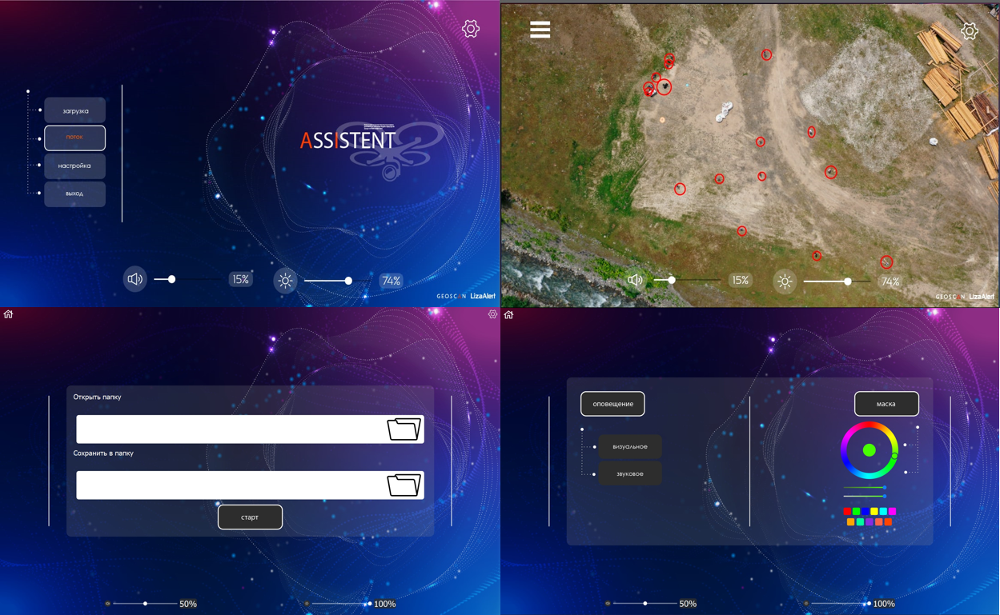

# Assistant-geoscan


Assistant-geoscan это приложение для сегментации людей с видеопотока(с камеры и видеоролика). Приложение реализованно с помощью PyQt5 и Deeplabv3. Приложение поддерживает обработку изображения с использование ядер cuda. 
#
## Проблематика и актуальность
Насколько бы далеко технологии не ушли, люди всё равно могут заблудиться. Как правило, зона поиска достаточно большая, из-за чего не всегда удаётся оказать своевременную помощь человеку. Для решения этой актуальной проблемы люди организовали добровольческие поисково-спасательные отряды, среди первых числится LizaAlert.
Основным инструментом для поиска у этих небезразличных людей являются дроны с камерами высокого разрешения. Для того, чтобы увеличить шанс заметить человека на экране в природных условиях под палящим солнцем, была поставлена задача разработать приложение, которое бы в режиме реального времени получало видео сигнал с дрона, обнаруживало человека с помощью нейросети, заливало его контуры выделяющимся цветом и показывало изображение на втором экране для команды, управляющей БПЛА.

## Инструкция
Чтобы установить приложение есть два пути:
1. Можно скачать installer.exe из [релизов](https://github.com/rootx-bel/assistent-geoscan/releases). Он установит приложение в папку assistent. Внутрь папки будет скачан файл main.exe, которой является главным исполняемым файлом. Для установки приложение потребуется 7 гб свободного места на диске.
2. Можно скачать исходный код приложения и использовать его. Для правильной работы приложения потребуется python версии 3.9.13
    1. В начале необходимо скачать репозиторий.
    ```
    git clone https://github.com/rootx-bel/assistent-geoscan.git
    ```
    2. Дальше нужно перейти в директорию и проинициализировать субмодули.
    ```
    cd assistent-geoscan
    git submodule update --init
    ```
    3. После необходимо установить зависимости для приложения командой:
    ```
    pip install -r requirements.txt
    ```
    4. В конце необходимо запустить приложение командой:
    ```
    python main.py
    ```
PS. Для запуска без нейеронной сети приложение необходимо запустить с командой --debug.
```
python main.py --debug
```
# Фото приложения
